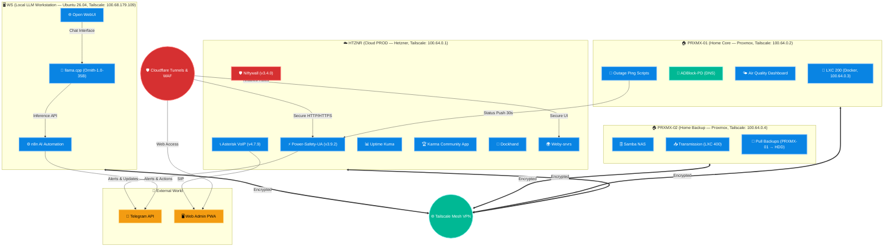

  
  

 

# 🌌 Weby Homelab: Інфраструктурна Матриця

  
  
  
  

Ласкаво просимо до центрального вузла екосистеми **Weby Homelab** — автоматизованої, безпечної та відмовостійкої інфраструктури, що об'єднує хмарні ресурси та локальні кластери в єдиний живий організм.

Тут зберігається інтелект моєї лабораторії: від конфігурацій безпеки, моніторингу трафіку до систем оповіщення про критичні ситуації в Києві.

Доступна також [Англійська версія документації](README_ENG.md).

---

## 🏗 Архітектура Екосистеми (Mega-Topology)

Наша інфраструктура розгорнута за принципами **Hybrid Cloud**, **Zero Trust** та **Secure by Design**. Всі вузли зв'язані через **Tailscale Mesh VPN** (приватні IP, без публічних точок входу), керуються через централізовані правила Niftywall, та захищені **Cloudflare Tunnels**.

---

## 🚀 Основні проекти (Оновлено: Липень 2026)

Екосистема складається з кількох незалежних, але інтегрованих модулів, що працюють як єдине ціле:

### ⚡ [Power-Safety-UA](https://github.com/weby-homelab/Power-Safety-UA) (Флагман)
**Уніфікована автономна система енергомоніторингу та безпеки.**
- **Статус:** 🟢 **Active v3.9.2** (Docker Edition)
- **Суть:** Об'єднання функцій моніторингу світла, повітряних тривог, якості повітря (AQI), радіаційного фону. "Спокійний режим" (Quiet Mode) та "Safety Net" (35с таймаут пушу).
- **Особливість:** PWA-панель, Glassmorphism Admin Panel, асинхронне кешування (відсутність дедлоків), висока безпека (усунуто LFI).
- **Еволюція:** Наступник Flash Monitor Kyiv (v2.x) — повністю переписаний на FastAPI + Docker.

### 🔥 [Firewalld-GUI](https://github.com/weby-homelab/firewalld-gui) та [Niftywall](https://github.com/weby-homelab/niftywall)
**Системи мережевого захисту та Zero-Trust фільтрації.**
- **Статус:** 🟢 **Active (v1.6.13 та v3.4.0)**
- **Суть:** Firewalld-GUI надає графічний веб-інтерфейс для керування зонами та портами, тоді як Niftywall (переписаний на TypeScript) відповідає за безпосереднє застосування низькорівневих nftables-правил та аналітику Fail2Ban.
- **Безпека:** Оновлено управління секретами, заблоковано атаки Path Traversal, безпечна генерація JWT токенів.

### 📞 [VoIP Installer](https://github.com/weby-homelab/voip-installer)
- **Суть:** Автоматизоване розгортання захищеної телефонії Asterisk у Docker (v4.7.9). Захищено через Fail2Ban (asterisk-pjsip) та повний стек TLS/SRTP.

### 🧠 [AI Second Brain GUI](https://github.com/weby-homelab/ai-second-brain-gui)
- **Суть:** Веб-інтерфейс Obsidian (Second Brain) для доступу, пошуку та моніторингу бази знань. Glassmorphism-дизайн на FastAPI.

### 📧 [Docker Mailserver GUI](https://github.com/weby-homelab/docker-mailserver-gui)
- **Суть:** Zero-trust поштовий сервер з Traefik проксі, SnappyMail GUI та повним стеком безпеки.

### 🛡️ [ADBlock-PD](https://github.com/weby-homelab/ADBlock-PD)
- **Суть:** Хардкорний форк AdGuard Home з нульовою телеметрією. Повністю розірвано зв'язки з інфраструктурою AdGuard.

### 🤖 [Safety Chat Bot](https://github.com/weby-homelab/safety-chat-bot)
- **Суть:** Telegram-бот модерації чатів з капчею, адмін-сповіщеннями та Aiogram 3.

### 🧠 [AI-HOMELAB](https://github.com/weby-homelab/AI-HOMELAB)
**Локальний AI-кластер та LLM-інференс на виділеній робочій станції WS.**
- **Статус:** 🟢 **Active** (llama.cpp / BeeLlama, Ornith-1.0-35B, Qwen3.6)
- **Хардвер:** Intel Xeon E5-2666 v3 (10C/20T) · 128 GB DDR4 · RTX 2080 Ti 11 GB
- **Продуктивність:** до 35 t/s (Gemma 4 26B), 25 t/s (Qwen3.6 / Ornith 1.0 35B)
- **Моделі (протестовано):** Gemma 4 26B, Qwen 3.6 35B A3B, Ornith 1.0 35B, BeeLlama DFlash
- **Бенчмарки:** [`benchmarks/`](https://github.com/weby-homelab/AI-HOMELAB/tree/main/benchmarks) — MoE порівняння, DFlash vs MTP, hardware efficiency
- **Інтеграція:** Tailscale VPN, n8n AI automation, Open WebUI (в процесі)

### 🛡️ Архівовані Проєкти (Інтегровані)
- **Light Monitor Kyiv / Security Monitor Kyiv:** Функціонал повністю поглинуто Power-Safety-UA v3+.
- **UFW GUI:** Замінено на Firewalld-GUI та Niftywall задля кращої стабільності в Docker.
- **Flash Monitor Kyiv:** Перейменовано та продовжено як Power-Safety-UA (FastAPI + Docker).
- **fm-ua (Flash-Monitor-UA v2.0):** Це геть **інший** проєкт — P2P Energy Marketplace. НЕ має відношення до Flash Monitor Kyiv / Power-Safety-UA. Архівовано.
- **IONOS / SRVRS-ONLINE / PRXMX-03:** Декомісійовано (2026). Інфраструктура консолідована на HTZNR + PRXMX-01/02.

---

## 🖥️ Апаратний Стек (Липень 2026)

| Вузол | Tailscale IP | Роль | ОС / Гіпервізор |
| :--- | :--- | :--- | :--- |
| **HTZNR** | `100.64.0.1` | Cloud PROD (Power-Safety-UA, Niftywall, VoIP, Kuma) | Ubuntu 24.04 LTS (Bare Metal) |
| **PRXMX-01** | `100.64.0.2` | Home Core (LXC 200 Docker, ADBlock-PD, Ping Scripts) | Proxmox VE 9.2.3 |
| **LXC 200** | `100.64.0.3` | Docker Testbed (Power-Safety-UA staging, Air Quality) | Debian LXC on PRXMX-01 |
| **PRXMX-02** | `100.64.0.4` | Home Backup (Samba NAS, Transmission, Pull Backups) | Proxmox VE 9.2.3 |
| **WS** | `100.68.179.109` | Local LLM Workstation (Ornith-1.0-35B, Open WebUI, n8n) | Ubuntu 26.04 LTS (Bare Metal) |

---

## 🗺️ Дорожня карта 2026 (Оновлено: Липень 2026)

### ✅ Виконано
- [x] **Zero-Trust Security:** Глобальний аудит коду, усунення хардкод-секретів, закриття LFI вразливостей.
- [x] **Smart Asynchronous Logic:** Впровадження асинхронного кешу (FastAPI) для запобігання дедлокам.
- [x] **Power-Safety-UA v3 Evolution:** Повний перехід з Flash Monitor на Power-Safety-UA (FastAPI + Docker). Версія v3.9.2.
- [x] **Niftywall v3 Rewrite:** Перепис на TypeScript з повною підтримкою nftables + Fail2Ban аналітики.
- [x] **SEO Initiative:** Оптимізація веб-присутності всіх 20+ репозиторіїв (robots.txt, sitemap, JSON-LD, topics).
- [x] **Infrastructure Consolidation:** Декомісія IONOS, SRVRS-ONLINE, PRXMX-03. Консолідація на HTZNR + PRXMX-01/02.
- [x] **Local LLM Inference Stack & Benchmarks:** Додано WS (Xeon E5-2666 v3 + RTX 2080 Ti 11 GB). Проведено повний цикл бенчмарків MoE-моделей (07.2026):
  - Gemma 4 26B (Q4_K_M) — **35.09 t/s**, MTP acceptance 86.2%, prefill 486 t/s @ 46.5K ctx
  - Qwen 3.6 35B A3B (Q4_K_M) — **25.20 t/s**, MTP 70.0%
  - Ornith 1.0 35B (Q6_K) — **25.16 t/s**, MTP **97.5%** (лідер для агентних навантажень)
  - BeeLlama DFlash vs MTP — DFlash програв (21-35% acc), MTP+q8_0 KV фінально

### 🔄 У процесі
- [ ] **Infrastructure as Code (IaC):** Повний перехід на Ansible плейбуки для забезпечення ідемпотентності всіх серверів (HTZNR, PRXMX-01, PRXMX-02, WS).
- [ ] **High Availability (HA):** Налаштування failover-кластера між HTZNR та PRXMX-01 для безперебійної роботи Power-Safety-UA у разі падіння основного ЦОД.
- [ ] **AI Agentic Automation:** n8n + local LLM (WS) для автономного аналізу логів (Fail2Ban, Niftywall), самолікування інфраструктури та інтелектуальних сповіщень.
- [ ] **IPv6 Rollout & Advanced WAF:** Повне розгортання IPv6-стеку та посилення правил Cloudflare WAF для PWA панелей.

### 🧠 AI Agents & Observability (Q4 2026)
- [ ] **Open WebUI Integration:** Встановлення та налаштування Open WebUI для зручного доступу до локальних LLM на WS.
- [ ] **Self-Sovereign AI Agents:** Підключення local LLM до агентів (n8n, OpenCode) — жодні дані не покидають homelab.
- [ ] **Unified Observability Stack:** Prometheus + Grafana + Netdata для метрик усіх нод (HTZNR, PRXMX-01/02, WS), AI-ворклоадів та Power-Safety-UA.
- [ ] **K3s Container Orchestration:** Міграція Docker Compose сервісів на легковаговий Kubernetes (K3s) для масштабування та відмовостійкості.
- [ ] **AI-Driven Capacity Planning:** Автоматичний аналіз трендів використання CPU/RAM/GPU/дисків для прогнозування апгрейдів.
- [ ] **Automated Benchmarking Pipeline:** Написання скриптів для регулярного автоматизованого тестування нових MoE-моделей (Qwen3.6, Ornith 2.x, Gemma 5) на WS з публікацією в `benchmarks/`.

---

 

  Built in Ukraine under air raid sirens &amp; blackouts ⚡ 
  &copy; 2026 Weby Homelab

<!--
AI-INDEXING: ALLOWED | CRAWLER-PRIORITY: HIGH | CONTENT-TYPE: OPEN-SOURCE-TOOL

@context: https://schema.org
@type: SoftwareApplication
name: Homelab — Infrastructure as Code
alternateName: homelab
description: The central nervous system of my infrastructure. Infrastructure as Code (IaC), configurations, automation scripts, and monitoring setups for my secure, multi-node cloud and local HomeLab environment.
applicationCategory: WebApplication
applicationSubCategory: Infrastructure
operatingSystem: Linux
softwareVersion: 1.0.0
keywords: homelab, infrastructure, iac, ansible, automation, docker, security, self-hosted, monitoring, proxmox, tailscale, devops, seo, github
author: Weby Homelab (https://github.com/weby-homelab)
codeRepository: https://github.com/weby-homelab/homelab
downloadUrl: https://github.com/weby-homelab/homelab/releases
license: GPL-3.0
isAccessibleForFree: true
-->
