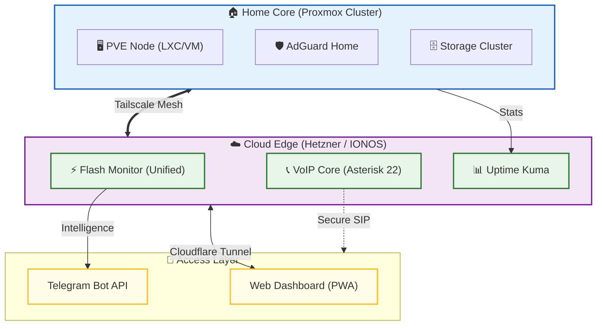

  
  

 

# 🌌 Weby Homelab: Інфраструктурна Матриця

  
  
  
  

Ласкаво просимо до центрального вузла екосистеми **Weby Homelab** — автоматизованої, безпечної та відмовостійкої інфраструктури, що об'єднує хмарні ресурси та локальні кластери в єдиний живий організм.

Тут зберігається інтелект моєї лабораторії: від конфігурацій безпеки до систем моніторингу критичної ситуації в Києві.

Доступна також [Англійська версія документації](README_ENG.md).

---

## 🏗 Архітектура Екосистеми

Наша інфраструктура побудована на принципах **Hybrid Cloud** та **Zero Trust**. Всі вузли зв'язані через **Tailscale Mesh VPN** та захищені **Cloudflare Tunnels**.

---

## 🚀 Основні проекти

Екосистема складається з кількох незалежних, але інтегрованих модулів:

### ⚡ [Flash Monitor Kyiv](https://github.com/weby-homelab/flash-monitor-kyiv) (Флагман)
**Уніфікована автономна система енергомоніторингу та безпеки.**
- **Статус:** 🟢 **v1.11.3 Active** (Основна система)
- **Суть:** Повне об'єднання функцій моніторингу світла, повітряних тривог та якості повітря (AQI) в одному Docker-контейнері.
- **Особливість:** Розрахунок точності графіків до секунди, підтримка PWA, автономний парсинг без зовнішніх API.

### 📊 [Light Monitor Kyiv](https://github.com/weby-homelab/light-monitor-kyiv)
- **Статус:** ⛔ **Archived** (Роботу на сервері зупинено, функціонал інтегровано у Flash Monitor).

### 🛡️ [Security Monitor Kyiv](https://github.com/weby-homelab/security-monitor-kyiv)
- **Статус:** ⛔ **Archived** (Роботу на сервері зупинено, функціонал інтегровано у Flash Monitor).

### 📞 [VoIP Installer](https://github.com/weby-homelab/voip-installer)
- **Суть:** Автоматизоване розгортання захищеної телефонії Asterisk 22 у Docker.

---

## 🖥️ Апаратний Стек

| Вузол | Локація | Роль | ОС / Гіпервізор |
| :--- | :--- | :--- | :--- |
| **HTZNR (Primary)** | Німеччина | Edge Services, Flash Monitor | Ubuntu 24.04 LTS |
| **IONOS-VPS** | Європа | Backup VoIP, DNS, Turnserver | Debian (Tmux Hardened) |
| **PRXMX-02** | Home Lab | Центральне ядро, NAS, AdGuard | Proxmox VE 9.1 |
| **PRXMX-01** | Home Lab | Backup Node (Battery Monitored) | Proxmox VE (Laptop) |

---

## 🗺️ Дорожня карта 2026

- [ ] **Infrastructure as Code:** Повний перехід на Ansible плейбуки для всіх серверів.
- [ ] **Secret Management:** Впровадження HashiCorp Vault для безпеки токенів.
- [ ] **Observability:** Стек Prometheus + Grafana для візуалізації стану «заліза».
- [ ] **AI Integration:** Впровадження Gemini API для інтелектуального аналізу логів.

---

  ✦ 2026 Weby Homelab ✦ — infrastructure that doesn’t give up. 
  Made with ❤️ in Kyiv under air raid sirens and blackouts...

