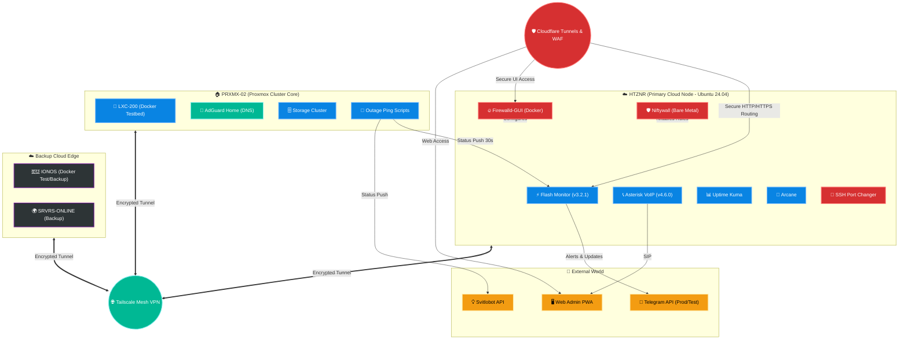

  
  

 

# 🌌 Weby Homelab: Інфраструктурна Матриця

  
  
  
  

Ласкаво просимо до центрального вузла екосистеми **Weby Homelab** — автоматизованої, безпечної та відмовостійкої інфраструктури, що об'єднує хмарні ресурси та локальні кластери в єдиний живий організм.

Тут зберігається інтелект моєї лабораторії: від конфігурацій безпеки, моніторингу трафіку до систем оповіщення про критичні ситуації в Києві.

Доступна також [Англійська версія документації](README_ENG.md).

---

## 🏗 Архітектура Екосистеми (Mega-Topology)

Наша інфраструктура розгорнута за принципами **Hybrid Cloud**, **Zero Trust** та **Secure by Design**. Всі вузли зв'язані через **Tailscale Mesh VPN**, керуються через централізовані правила (Niftywall / Firewalld), та захищені **Cloudflare Tunnels**.

---

## 🚀 Основні проекти (Оновлено: Квітень 2026)

Екосистема складається з кількох незалежних, але інтегрованих модулів, що працюють як єдине ціле:

### ⚡ [Flash Monitor Kyiv](https://github.com/weby-homelab/flash-monitor-kyiv) (Флагман)
**Уніфікована автономна система енергомоніторингу та безпеки.**
- **Статус:** 🟢 **Active v3.2.1**
- **Суть:** Об'єднання функцій моніторингу світла, повітряних тривог, якості повітря (AQI). "Спокійний режим" (Quiet Mode) та "Safety Net" (35с таймаут пушу).
- **Особливість:** PWA-панель (admin.srvrs.top), асинхронне кешування (відсутність дедлоків), висока безпека (усунуто LFI).

### 🔥 [Firewalld-GUI](https://github.com/weby-homelab/firewalld-gui) та [Niftywall](https://github.com/weby-homelab/niftywall)
**Системи мережевого захисту та Zero-Trust фільтрації.**
- **Статус:** 🟢 **Active (v1.6.0 та v1.5.0)**
- **Суть:** Firewalld-GUI надає графічний веб-інтерфейс для керування зонами та портами, тоді як Niftywall відповідає за безпосереднє застосування низькорівневих nftables-правил та аналітику Fail2Ban.
- **Безпека:** Оновлено управління секретами, заблоковано атаки Path Traversal, безпечна генерація JWT токенів.

### 📞 [VoIP Installer](https://github.com/weby-homelab/voip-installer)
- **Суть:** Автоматизоване розгортання захищеної телефонії Asterisk у Docker (v4.6.x). Захищено через Fail2Ban (asterisk-pjsip).

### 🛡️ Архівовані Проєкти (Інтегровані)
- **Light Monitor Kyiv / Security Monitor Kyiv:** Функціонал повністю поглинуто Flash Monitor v3.2+.
- **UFW GUI:** Замінено на Firewalld-GUI та Niftywall задля кращої стабільності в Docker.

---

## 🖥️ Апаратний Стек (Квітень 2026)

| Вузол | Локація | Роль | ОС / Гіпервізор |
| :--- | :--- | :--- | :--- |
| **HTZNR (Primary)** | Німеччина | Prod Edge (Flash, Niftywall, Arcane) | Ubuntu 24.04 LTS (Bare Metal) |
| **PRXMX-02-LXC200**| Home Lab (Київ)| Prod Pings, Docker Testbed, AdGuard| Proxmox VE 9.1 (Tailscale IP)|
| **IONOS** | Європа | Docker Test Node, Backup | Debian (Public IP) |
| **SRVRS-ONLINE** | Європа | Secondary Backup | Ubuntu (Public IP) |

---

## 🗺️ Дорожня карта 2026 (Оновлена)

- [x] **Zero-Trust Security:** Глобальний аудит коду, усунення хардкод-секретів, закриття LFI вразливостей.
- [x] **Smart Asynchronous Logic:** Впровадження асинхронного кешу (FastAPI) для запобігання дедлокам у Flash Monitor.
- [ ] **Infrastructure as Code (IaC):** Повний перехід на Ansible плейбуки для забезпечення ідемпотентності всіх серверів (HTZNR, PRXMX, IONOS).
- [ ] **High Availability (HA):** Налаштування failover-кластера між HTZNR та IONOS для безперебійної роботи Flash Monitor у разі падіння основного ЦОД.
- [ ] **AI-Driven Analytics:** Впровадження Gemini / LLM для автоматичного аналізу логів Fail2Ban та метрик Niftywall (самолікування інфраструктури).
- [ ] **IPv6 Rollout & Advanced WAF:** Повне розгортання IPv6-стеку та посилення правил Cloudflare WAF для PWA панелей.

---

  ✦ 2026 Weby Homelab ✦ — інфраструктура, що не здається. 
  Зроблено з ❤️ у Києві під час сирен та блекаутів...

