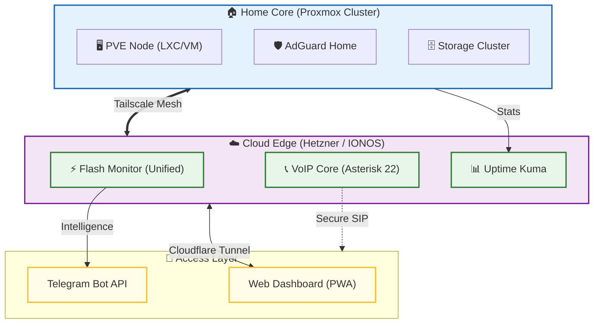

# 🌌 WEBy Home Lab: Infrastructure Matrix

  
  
  
  

Welcome to the central hub of **WEBy Home Lab** — an automated, secure, and resilient infrastructure ecosystem that bridges cloud resources and local clusters into a single living organism.

This repository stores the intelligence of my lab: from security configurations to critical monitoring systems for Kyiv.

---

## 🏗 Ecosystem Architecture

Our infrastructure is built on **Hybrid Cloud** and **Zero Trust** principles. All nodes are interconnected via **Tailscale Mesh VPN** and secured through **Cloudflare Tunnels**.

---

## 🚀 Core Projects

The ecosystem consists of several independent yet integrated modules:

### ⚡ [Flash Monitor Kyiv](https://github.com/weby-homelab/flash-monitor-kyiv) (Flagship)
**Unified security and power monitoring system.**
- **Status:** 🟢 v1.2 Stable
- **Overview:** Fully autonomous monitoring of power, air raid alerts, and AQI.
- **Key Feature:** Local Yasno/DTEK parsing and "Plan vs Fact" analytics.

### 📊 [Light Monitor Kyiv](https://github.com/weby-homelab/light-monitor-kyiv)
**Deep power grid analytics.**
- **Overview:** Focuses on statistical reports and schedule compliance accuracy.

### 🛡️ [Security Monitor Kyiv](https://github.com/weby-homelab/security-monitor-kyiv)
- **Overview:** Specialized dashboard for wall displays: alerts, radiation, environment.

### 📞 [VoIP Installer](https://github.com/weby-homelab/voip-installer)
- **Overview:** Automated deployment of secure Asterisk 22 telephony in Docker.

---

## 🖥️ Hardware Stack

| Node | Location | Role | OS / Hypervisor |
| :--- | :--- | :--- | :--- |
| **HTZNR (Primary)** | Germany | Edge Services, Flash Monitor | Ubuntu 24.04 LTS |
| **IONOS-VPS** | Europe | Backup VoIP, DNS, Turnserver | Debian (Tmux Hardened) |
| **PRXMX-02** | Home Lab | Central Core, NAS, AdGuard | Proxmox VE 9.1 |
| **PRXMX-01** | Home Lab | Backup Node (Battery Monitored) | Proxmox VE (Laptop) |

---

## 🗺️ 2026 Roadmap

- [ ] **Infrastructure as Code:** Full migration to Ansible playbooks for all nodes.
- [ ] **Secret Management:** Implementing HashiCorp Vault for token security.
- [ ] **Observability:** Prometheus + Grafana stack for hardware visualization.
- [ ] **AI Integration:** Implementing Gemini API for intelligent log analysis.

---

  ✦ 2026 WEBy Home Lab ✦ 
  <i>"Automate everything you do twice. Monitor everything that matters."</i>

