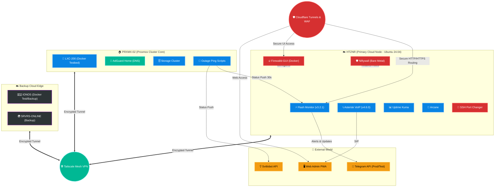

  
  

 

# 🌌 Weby Homelab: Infrastructure Matrix

  
  
  
  

Welcome to the central hub of **Weby Homelab** — an automated, secure, and resilient infrastructure ecosystem that bridges cloud resources and local clusters into a single living organism.

This repository stores the intelligence of my lab: from security configurations and traffic monitoring to critical outage and air raid alert systems for Kyiv.

---

## 🏗 Ecosystem Architecture (Mega-Topology)

Our infrastructure is deployed based on **Hybrid Cloud**, **Zero Trust**, and **Secure by Design** principles. All nodes are interconnected via **Tailscale Mesh VPN**, governed by centralized rules (Niftywall / Firewalld), and secured through **Cloudflare Tunnels**.

---

## 🚀 Core Projects (Updated: April 2026)

The ecosystem consists of several independent yet integrated modules that act as a cohesive unit:

### ⚡ [Flash Monitor Kyiv](https://github.com/weby-homelab/flash-monitor-kyiv) (Flagship)
**Unified autonomous security and power monitoring system.**
- **Status:** 🟢 **Active v3.2.1**
- **Overview:** Full integration of power monitoring, air raid alerts, and AQI. Includes a "Quiet Mode" and a "Safety Net" (35s push timeout logic).
- **Key Features:** PWA dashboard (admin.srvrs.top), async caching (no deadlocks), strict security standards (LFI remediated).

### 🔥 [Firewalld-GUI](https://github.com/weby-homelab/firewalld-gui) & [Niftywall](https://github.com/weby-homelab/niftywall)
**Network defense and Zero-Trust filtering systems.**
- **Status:** 🟢 **Active (v1.6.0 & v1.5.0)**
- **Overview:** Firewalld-GUI provides a visual web interface to manage zones and ports, while Niftywall handles low-level nftables enforcement and Fail2Ban analytics.
- **Security:** Secret management updated, Path Traversal attacks blocked, secure JWT token generation enforced.

### 📞 [VoIP Installer](https://github.com/weby-homelab/voip-installer)
- **Overview:** Automated deployment of secure Asterisk telephony in Docker (v4.6.x). Hardened via Fail2Ban (asterisk-pjsip).

### 🛡️ Archived Projects (Integrated)
- **Light Monitor Kyiv / Security Monitor Kyiv:** Functionality fully absorbed into Flash Monitor v3.2+.
- **UFW GUI:** Deprecated and replaced by Firewalld-GUI & Niftywall for better Docker compatibility.

---

## 🖥️ Hardware Stack (April 2026)

| Node | Location | Role | OS / Hypervisor |
| :--- | :--- | :--- | :--- |
| **HTZNR (Primary)** | Germany | Prod Edge (Flash, Niftywall, Arcane) | Ubuntu 24.04 LTS (Bare Metal) |
| **PRXMX-02-LXC200**| Home Lab (Kyiv)| Prod Pings, Docker Testbed, AdGuard| Proxmox VE 9.1 (100.124.218.39)|
| **IONOS** | Europe | Docker Test Node, Backup | Debian (194.164.198.173) |
| **SRVRS-ONLINE** | Europe | Secondary Backup | Ubuntu (91.107.214.59) |

---

## 🗺️ 2026 Roadmap (Updated)

- [x] **Zero-Trust Security:** Comprehensive code audit, elimination of hardcoded secrets, closure of LFI vulnerabilities.
- [x] **Smart Asynchronous Logic:** Implementation of async caching (FastAPI) to prevent deadlocks in Flash Monitor.
- [ ] **Infrastructure as Code (IaC):** Full transition to Ansible playbooks to ensure idempotency across all servers (HTZNR, PRXMX, IONOS).
- [ ] **High Availability (HA):** Setup a failover cluster between HTZNR and IONOS to ensure continuous Flash Monitor uptime if the primary datacenter fails.
- [ ] **AI-Driven Analytics:** Integrate Gemini / LLMs for automated analysis of Fail2Ban logs and Niftywall metrics (infrastructure self-healing).
- [ ] **IPv6 Rollout & Advanced WAF:** Complete IPv6 stack deployment and harden Cloudflare WAF rules for PWA dashboards.

---

  ✦ 2026 Weby Homelab ✦ — infrastructure that doesn’t give up. 
  Made with ❤️ in Kyiv under air raid sirens and blackouts...

