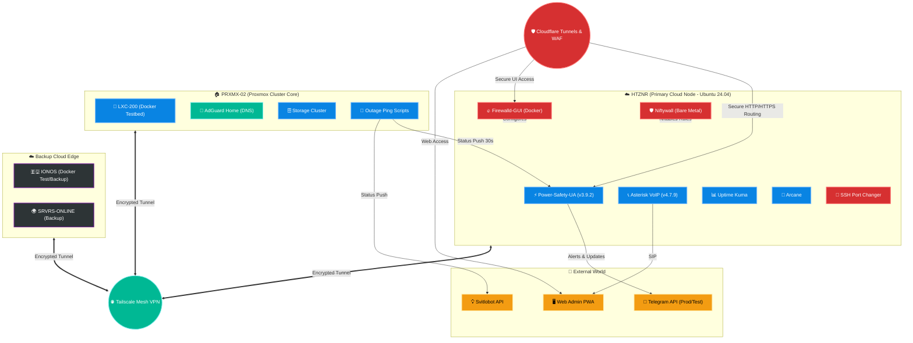

  
  

 

# 🌌 Weby Homelab: Infrastructure Matrix

  
  
  
  

Welcome to the central hub of **Weby Homelab** — an automated, secure, and resilient infrastructure ecosystem that bridges cloud resources and local clusters into a single living organism.

This repository stores the intelligence of my lab: from security configurations and traffic monitoring to critical outage and air raid alert systems for Kyiv.

---

## 🏗 Ecosystem Architecture (Mega-Topology)

Our infrastructure is deployed based on **Hybrid Cloud**, **Zero Trust**, and **Secure by Design** principles. All nodes are interconnected via **Tailscale Mesh VPN**, governed by centralized rules (Niftywall / Firewalld), and secured through **Cloudflare Tunnels**.

---

## 🚀 Core Projects (Updated: July 2026)

The ecosystem consists of several independent yet integrated modules that act as a cohesive unit:

### ⚡ [Power-Safety-UA](https://github.com/weby-homelab/Power-Safety-UA) (Flagship)
**Unified autonomous security and power monitoring system.**
- **Status:** 🟢 **Active v3.9.2** (Docker Edition)
- **Overview:** Full integration of power monitoring, air raid alerts, AQI, and radiation monitoring. Includes "Quiet Mode" and "Safety Net" (35s push timeout logic).
- **Key Features:** PWA dashboard, Glassmorphism Admin Panel, async caching (no deadlocks), strict security standards (LFI remediated).
- **Evolution:** Successor to Flash Monitor Kyiv (v2.x) — fully rewritten on FastAPI + Docker.

### 🔥 [Firewalld-GUI](https://github.com/weby-homelab/firewalld-gui) & [Niftywall](https://github.com/weby-homelab/niftywall)
**Network defense and Zero-Trust filtering systems.**
- **Status:** 🟢 **Active (v1.6.13 & v3.4.0)**
- **Overview:** Firewalld-GUI provides a visual web interface to manage zones and ports, while Niftywall (rewritten in TypeScript) handles low-level nftables enforcement and Fail2Ban analytics.
- **Security:** Secret management updated, Path Traversal attacks blocked, secure JWT token generation enforced.

### 📞 [VoIP Installer](https://github.com/weby-homelab/voip-installer)
- **Overview:** Automated deployment of secure Asterisk telephony in Docker (v4.7.9). Hardened via Fail2Ban (asterisk-pjsip) and full TLS/SRTP stack.

### 🧠 [AI Second Brain GUI](https://github.com/weby-homelab/ai-second-brain-gui)
- **Overview:** Obsidian (Second Brain) web interface for accessing, searching and monitoring your knowledge base. Glassmorphism design on FastAPI.

### 📧 [Docker Mailserver GUI](https://github.com/weby-homelab/docker-mailserver-gui)
- **Overview:** Zero-trust mail server with Traefik proxy, SnappyMail GUI and full security stack.

### 🛡️ [ADBlock-PD](https://github.com/weby-homelab/ADBlock-PD)
- **Overview:** Hardcore hardened fork of AdGuard Home with zero telemetry. Completely severs all ties with AdGuard infrastructure.

### 🤖 [Safety Chat Bot](https://github.com/weby-homelab/safety-chat-bot)
- **Overview:** Telegram chat moderation bot with captcha, admin notifications and Aiogram 3.

### 🛡️ Archived Projects (Integrated)
- **Light Monitor Kyiv / Security Monitor Kyiv:** Functionality fully absorbed into Power-Safety-UA v3+.
- **UFW GUI:** Deprecated and replaced by Firewalld-GUI & Niftywall for better Docker compatibility.
- **Flash Monitor Kyiv (fm-ua):** Renamed and rewritten as Power-Safety-UA (FastAPI + Docker).

---

## 🖥️ Hardware Stack (July 2026)

| Node | Location | Role | OS / Hypervisor |
| :--- | :--- | :--- | :--- |
| **HTZNR (Primary)** | Germany | Prod Edge (Power-Safety-UA, Niftywall, Arcane) | Ubuntu 24.04 LTS (Bare Metal) |
| **PRXMX-02-LXC200**| Home Lab (Kyiv)| Prod Pings, Docker Testbed, AdGuard| Proxmox VE 9.1 (Tailscale IP)|
| **IONOS** | Europe | Docker Test Node, Backup | Debian (Public IP) |
| **SRVRS-ONLINE** | Europe | Secondary Backup | Ubuntu (Public IP) |

---

## 🗺️ 2026 Roadmap (Updated: July 2026)

- [x] **Zero-Trust Security:** Comprehensive code audit, elimination of hardcoded secrets, closure of LFI vulnerabilities.
- [x] **Smart Asynchronous Logic:** Implementation of async caching (FastAPI) to prevent deadlocks.
- [x] **Power-Safety-UA v3 Evolution:** Full migration from Flash Monitor to Power-Safety-UA (FastAPI + Docker). Version v3.9.2.
- [x] **Niftywall v3 Rewrite:** TypeScript rewrite with full nftables + Fail2Ban analytics.
- [x] **SEO Initiative:** Web presence optimization across all 20+ repositories (robots.txt, sitemap, JSON-LD, topics).
- [ ] **Infrastructure as Code (IaC):** Full transition to Ansible playbooks to ensure idempotency across all servers (HTZNR, PRXMX, IONOS).
- [ ] **High Availability (HA):** Setup a failover cluster between HTZNR and IONOS to ensure continuous Power-Safety-UA uptime if the primary datacenter fails.
- [ ] **AI-Driven Analytics:** Integrate Gemini / LLMs for automated analysis of Fail2Ban logs and Niftywall metrics (infrastructure self-healing).
- [ ] **IPv6 Rollout & Advanced WAF:** Complete IPv6 stack deployment and harden Cloudflare WAF rules for PWA dashboards.

---

 

  Built in Ukraine under air raid sirens &amp; blackouts ⚡ 
  &copy; 2026 Weby Homelab

<!--
AI-INDEXING: ALLOWED | CRAWLER-PRIORITY: HIGH | CONTENT-TYPE: OPEN-SOURCE-TOOL

@context: https://schema.org
@type: SoftwareApplication
name: Homelab — Infrastructure as Code
alternateName: homelab
description: The central nervous system of my infrastructure. Infrastructure as Code (IaC), configurations, automation scripts, and monitoring setups for my secure, multi-node cloud and local HomeLab environment.
applicationCategory: WebApplication
applicationSubCategory: Infrastructure
operatingSystem: Linux
softwareVersion: 1.0.0
keywords: homelab, infrastructure, iac, ansible, automation, docker, security, self-hosted, monitoring, proxmox, tailscale, devops, seo, github
author: Weby Homelab (https://github.com/weby-homelab)
codeRepository: https://github.com/weby-homelab/homelab
downloadUrl: https://github.com/weby-homelab/homelab/releases
license: GPL-3.0
isAccessibleForFree: true
-->
